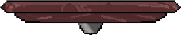

# Entry 4
##### 3/16/24

### Process

To recap, my tool is [KaboomJS](https://kaboomjs.com/), and for several weeks I have been learning how to use it. After writing entry 3, I began building my [MVP(Minimum Viable Product)](https://hstatsep.github.io/students/) of my parkour game. To start off, the first thing I coded was the basic parts of every game including my game which was the gravity, and background. For background, I wanted it to take up the full size of the kaboom canva, basically making it equal to the width and height that I set my kaboom equal to. To do so, I loaded, and then added a filler sprite to an `add[()]` and set the size of it to equal the `width()`, and `height()` of the canva. This allowed my background sprite to take up the whole canva. As for the gravity, all I did was declare a `setGravity(#)` in the very beginning of my code. Below is the code for it:

``` js
setGravity(1600),

        loadSprite("background", "sprites/KaboomSprite.PNG"),
        loadSprite("player", "sprites/bean.png")
        loadSprite("monster", "sprites/bean.png")
        loadSprite("platform", "sprites/bean.png")

       add([
            sprite("background", {width: width(), height: height()}),
            fixed(),
        ])
```

Before I came up with a solution to make my background the same size as my canva, I tried many other options, like trying to put the background sprite in the center, and then scaling it. However, this didn't work. I tried using `pos(CENTER)`, and `pos(width()/2, and height()/2)` to get the sprite to be in the center of my canva but no matter what I changed, the sprite would never move. I for a long time and eventually created the code above that did work.

After the gravity, and background was done, I began creating an level using `addLevel()`, that had platforms and a floor that was solid. To start, I added symbols to my `addLevel()` so that I can later declare what each symbol meant. Next, I set the `tileWeight`, and `tileHeight` to an number that is decently big, and can be used to divide by the width and height of my canva. Then, I declared what each symbol above meant, or in other words set them to a filler sprite, and made them solid using `isstatis: true` depending on the symbol. Then, I gave them each a `pos()` and `area()` so that the `body()` works. This allowed me to create a level or a second "background"/map. Of course I stored all this inside an const so that I can easily access the level later on to add certain codes on top. Below is the code:

``` js
    const mymap = addLevel([
            "                                                  ",
            "                                                  ",
            "                                                  ",
            "                                                  ",
            "     1                                            ",
            "                                                  ",
            "                                                  ",
            "                                                  ",
            "                                               1  ",
            "==================================================",
        ], {
            tileWidth: 16,
            tileHeight: 30,
            tiles: {
                "=": () =>  [
                    sprite("bean"),
                    pos(0, 400),
                    body({ isStatic: true }),
                    area(),
                ],
                "1": () => [
                    sprite("platform"),
                    body({ isStatic: true }),
                    area(),
                    pos(),
                ]
            }
        })
```

When I finished with the level, I decided to now replace some of my sprites to the real sprites I'm going to use in my game. I first thought to use premade sprites from some pixel sprite websites, and just import it into my files. However, I thought that would be too unoriginal, so I decided to why not create my own pixel art using the [piskel](https://www.piskelapp.com/) website. To begin, I spend hours watching videos, learning what each tools and functions does, animations, and so on. I tinkered with it by creating some random art like a beating heart to practice the tools available for me to use. When I was done learning how to use the piskel website, I created my own platform sprite, and even animated it to shoot out fire while going up and down. The sprite took over 2 hours to create, but it looked very good since I added alot of contrast and shades. AFter all that was done, I made the animation and no animation files into a png, and imported it into my sprite folder so that I can change the current symbol declared sprite to this new platform. Below is the sprite:

()


A week later, I decided to code the movements of my sprite. I first started off with coding my sprite to jump infinite amount of times. This was easy as I have already coded this once when I was learning my tool. However, coding my sprite to move right and left was the hard part. I was only able to make it move to a certain pos when it's clicked using `moveTo()`, but I had no idea how to make my sprite move by a certain pixel when the key is pressed down. I tried copying the examples in kaboomjs but it gave me syntax, and undefined error. I tried watching youtube videos, and adding random numbers to the `move()` but it still did not work. I continued trying until I realized that my syntax of the move was so wrong, since I forgot the :. When I fixed this problem my sprite was able to move at a certain speed in a certain direction. I did exact what I did with the right key with the left key but instead changed the numbers in it to become negative so that it moves towards the left side. Below is the code:

```js
    onKeyPress("space", () => {
            player.jump()
    })

    onKeyDown("right", () => {
            player.move(120, 200)
    })

    onKeyDown("left", () => {
            player.move(-120, 200)
    })

```

After finishing with the movements, I wanted to code a code that will make it so that my bean sprite will disapear whenever it touches another sprite. This will allow me to make my parkour game more challenging since there will be enemies the user will have to dodge. To code this, I added a .collide to my const player, and added destory inside of the {}. However, when I tested it out, it gave me an error since the computer didn't know what destory meant, and said that it needed a tag. So, I add `.use` to my player and gave it a tag of player, and set the destroy to that tag so that anything with that tag will disapear whenever the sprite touches another sprite. Below is the code:

```js
    loadSprite("monster", "sprites/bean.png")

    player.onCollide("monster", () => {
            destroy(player)
    })
```
I also coded the camera to move whenever my sprites moves using onUpdate(), and cam(pos()). This was not an easy task since I haven't learned how to use it, but I researched, tested it out using different numbers and watched videos on creating a game until I understood how to make my camera move. Besides this, my friend ada helped me to make an monster sprite move towards a direction forever using move(). Since it doesn't move back and forth, I decided to code two monster sprites that each moved towards one direction. However, this was not efficient so I decided to try and learn how to make one sprite move back and forth. However, I couldnt figure out how to do so, so in my learning log I will continued trying to figure it out. Below is the code for camera:

``` js
    player.onUpdate(() => {
                camPos(player.pos)
                shake(1)
            })
```

The last thing I coded before writing this entry was a code that made my sprite jump only a certain amount of times. I first added `.jump()` to `keyDown()` and set a number inside the () of `.jump()` to tell the computer to only allow it to jump that many times. However, not to my surprise it did not work, so I had to figure out other ways to make it work. The next two method I tried was one adding `.doublejump(#)` instead of `.jump(#)` and two putting `.doublejump()` inside `.jump()`. Of course, these tries didn't work, so I had to continue trying my best to come up with a solution. Eventually, I was able to make my sprite jump x amount of times by adding `doubleJump(#)` inside of my const player, and putting `.doubleJump()` instead `keyDown()`. This worked because I declared the amount of jumps that the sprite is allowed inside the const before making the sprite jump using .doubleJump. Below is the code:

```js
const player = add([
            sprite("player"),
            pos(),
            body(),
            doubleJump(2),
            area(),
        ])

    onKeyPress("space", () => {
            player.doubleJump()
        })
```

In summary, I was able to code my background, my sprites, the sprites movements, the levels, and the camera during this entry. Now I'm about 30% done with my MVP, since a lot of the basic conponments are coded.


### Enginnering design process

Currently we are on step 5 and 6 of the [Engineering Design Process](https://hstatsep.github.io/students/) which is to create the prototype, and test/evaulate the prototype. Soon I hope to improve, communicate and showcase my game to my fellow classmates, friends, and in the SEP EXPO. However, as of now my next step is to try and finish coding my MVP so that I can have time to add in beyond MVP things like animations. In terms of the EDP, my next steps (7 and 8) is to improve as needed, and communicate the results which is exactly what I hope to do next.

### Skills

The skills I improved on in this entry was problem decomposition, and time management. To me, problem decomposition is the ability to break your big task into doable smaller tasks, while time management is the ability to do those smaller task in a good amount of time. In this entry these two skills were the ones I used the most because I had to break this whole game into smaller pieces so that I am able to code it, and actually do them within a set time. For instance, the movement of a sprite is a huge task to code. However I was able to break them down into left, right, and jump. This allowed me to visual how each code works, and code each individual pieces, within a time limit, so that I am able to finish my MVP before the date. Another example, is when I coded `addLevel()`. `AddLevel()` is a very long code and has many parts to it. Instead of looking at the code as a whole, I was able to break it down into three sections, which was the how the map looked, the width and height of each tile, and most importantly defining the symbol. This not only allowed me to use my time wisely (time management), but it also allowed me to feel less stress, and motivated to actually code it. In conclusion, I have improved quite alot on the skill of problem decomposition, and time management but there are still an infinite amount of room for me to grow in.


[Previous](entry03.md) | [Next](entry05.md)

[Home](../README.md)